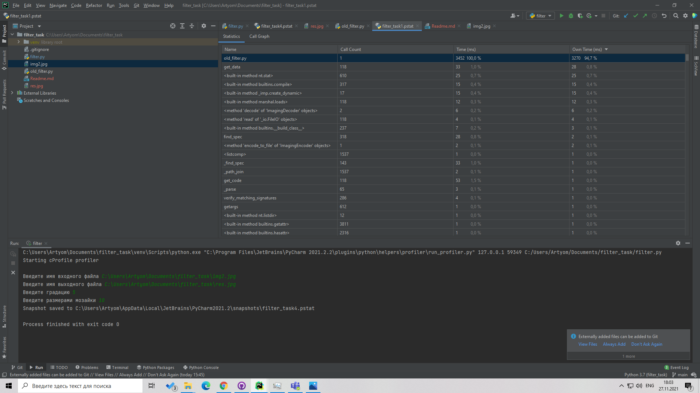
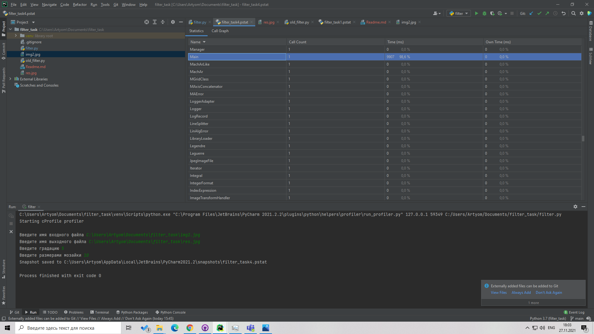
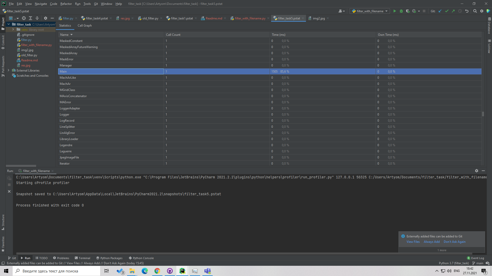

Большая часть времени программы filter.py тратится на ввод данных, из-за этого в профилировщике она работает медленнее. 

В программе filter_with_filename.py отсутствует пользовательский ввод и программа работает быстрее в 2 раза, одна из причин это отсутствие глобальных переменных с которыми питон работает медленнее 
